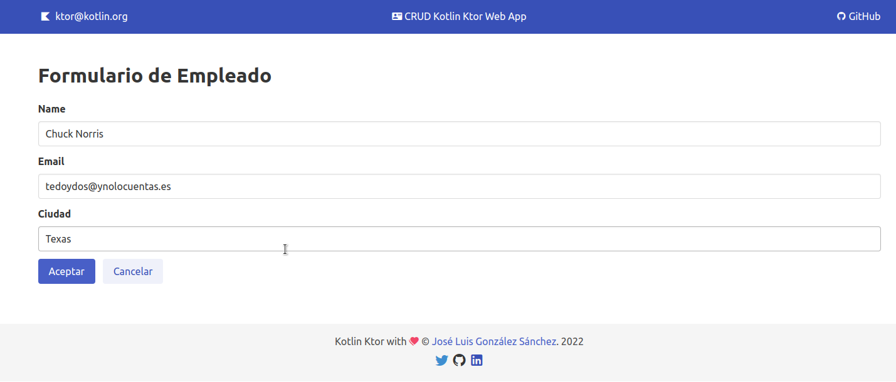

# Kotlin Ktor WEB App
Sencilla aplicación web para realizar un CRUD usando Ktor y motores de plantillas similar a Laravel con PHP.  

- [Kotlin Ktor WEB App](#kotlin-ktor-web-app)
  - [Acerca de](#acerca-de)
  - [Ktor](#ktor)
  - [Autor](#autor)
    - [Contacto](#contacto)
  - [Licencia](#licencia)

## Acerca de
El proyecto consiste en realizar una sencilla aplicación web que genera páginas dinámicas en el servidor siguiendo la filosofía PHP/Laravel. Con ello se ha realizado una aplicaación web que permite realizar un CRUD sobre un recurso. Para el almacenamiento de la información se ha usado una H2 Database donde la usamos gracias a la librería de Jetbrains [Exposed](https://github.com/JetBrains/Exposed).

## Ktor
[Ktor](https://ktor.io/) es un nuevo framework para desarrollar servicios y clientes asincrónicos. Es 100% [Kotlin](https://kotlinlang.org/) y se ejecuta en usando [Coroutines](https://kotlinlang.org/docs/coroutines-overview.html). Admite proyectos multiplataforma, lo que significa que puede usarlo para cualquier proyecto dirigido a JVM, Android, iOS o Javascript. En este proyecto aprovecharemos Ktor para crear un servicio web para consumir una API REST. Además, aplicaremos Ktor para devolver páginas web.

Para más información de cómo usar Ktor, puedes consultar mi anterior proyecto [Kotlin-Ktor-REST-Service](https://github.com/joseluisgs/Kotlin-Ktor-REST-Service).

## Autor

Codificado con :sparkling_heart: por [José Luis González Sánchez](https://twitter.com/joseluisgonsan)

### Contacto

  Cualquier cosa que necesites házmelo saber por si puedo ayudarte 💬.

     &nbsp;&nbsp;
     &nbsp;&nbsp;
      &nbsp;&nbsp;
    

## Licencia

Este proyecto está licenciado bajo licencia **MIT**, si desea saber más, visite el fichero [LICENSE](./LICENSE) para su uso docente y educativo.